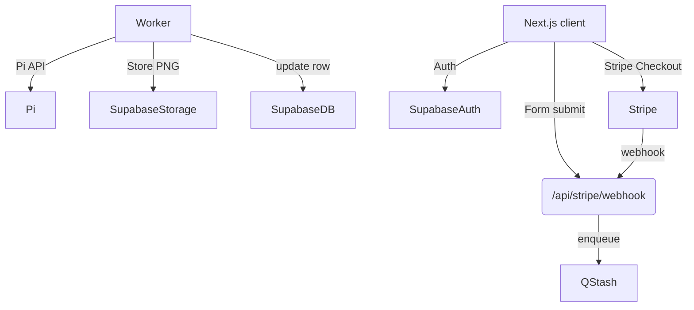

# Action‑Figure Generator – Product Requirement Document (PRD)

**Version:** v1.0   |   **Status:** Draft   |   **Last updated:** 2025‑04‑21

---

## 1. Purpose & Vision

Create a fast, fun web app that turns a user‑supplied face photo into a high‑resolution *boxed action‑figure* mock‑up. The app sells two paid plans—**Single** (1 image) and **Group** (up to 4 images)—and delivers the final PNG for personal use. The MVP is designed for rapid shipping, minimal infra cost, and easy iteration.

## 2. Goals & Success Metrics

| Goal            | Metric                                | Target |
| --------------- | ------------------------------------- | ------ |
| Revenue         | ≥ CA \$300 MRR within 90 days         | ✔︎     |
| Conversion      | ≥ 20 % of new uploads purchase a plan | ✔︎     |
| Performance     | Time‑to‑image ≤ 40 s P50              | ✔︎     |
| Reliability     | Failed generations < 2 % / 1 000      | ✔︎     |
| Cost efficiency | Gross margin ≥ 70 % per image         | ✔︎     |

## 3. Out‑of‑Scope (v1)

- Video or GIF export
- Custom box artwork editor
- Admin CMS UI (CLI / SQL enough for v1)
- Mobile native apps

## 4. User Personas

| Persona             | Needs                                     | Pain Points                      |
| ------------------- | ----------------------------------------- | -------------------------------- |
| **Collector Chris** | Quick novelty portrait; share on socials. | Doesn't want to learn Photoshop. |
| **Parent Priya**    | Group figure of family; safe upload flow. | Concerned about privacy.         |
| **Gifter Gabe**     | Buy once, print on mug.                   | Needs hi‑res image.              |

## 5. Functional Requirements

### 5.1 Authentication (Must‑Have)

| Option                        | Pros                                                     | Cons                             | 1‑Click Setup?                     |
| ----------------------------- | -------------------------------------------------------- | -------------------------------- | ---------------------------------- |
| **Supabase Auth** *(default)* | Same dashboard as DB & Storage; RLS works out‑of‑the‑box | Slightly less polished UI        | `npx supabase auth ui` — **5 min** |
| **Clerk**                     | Beautiful pre‑built modals; SMS login                    | Extra vendor, no RLS integration | `npx create-clerk-app` — **5 min** |

**Decision:** Start with **Supabase Auth** for MVP simplicity. Swap to Clerk later if you need advanced social or SMS flows; DB adapter change is isolated.

### 5.2 Credits & Plans (Must‑Have) Credits & Plans (Must‑Have)

| Plan            | Price (CAD) | Credits | Stripe `price_id`  |
| --------------- | ----------- | ------- | ------------------ |
| Single          | \$1.99      | 1       | `price_single_199` |
| Group (4 × API) | \$6.99      | 4       | `price_group_699`  |

- Credits stored in `credits.balance` (int).
- Webhook `/api/stripe/webhook` increments balance on `checkout.session.completed`.

### 5.3 Upload & Form (Must‑Have)

- Accept JPEG/PNG ≤ 8 MB.
- Fields: `name`, `tagline`, `accessories[]`, `box_color` (preset).
- Front‑end validation & S3 pre‑signed upload (Supabase Storage).

### 5.4 Generation Pipeline (Must‑Have)

1. Queue job (Upstash QStash) if user has ≥ 1 credit.
2. Worker builds prompt JSON → calls **Pi API** `POST /v1/generate` (see § 10).
3. Poll status until `succeeded` or timeout 120 s.
4. Store PNG + thumb in bucket `public/figures/{userId}/{figureId}.png`.
5. Decrement credits; update `figures.status`.
6. Display in-app notification (toast) to user.

### 5.5 Gallery & Download (Should‑Have)

- Paginated list (most recent first).
- Signed URL expires in 1 h.
- Delete figure (soft delete) and restore credit is **Out‑of‑scope** v1.

### 5.6 Billing History (Should‑Have)

- List Stripe charges & credit purchases.

### 5.7 Content Moderation (Must‑Have)

- Reject NSFW via Pi `moderationScore > 0.5`.
- Purge raw uploads after 30 days (cron).

### 5.8 Security (Must‑Have)

- Row‑Level Security on all tables (`user_id = auth.uid()`).
- All secrets stored in Vercel env vars.
- Helmet headers via `next-secure-headers`.

## 6. Non‑Functional Requirements

| Aspect        | Requirement                                                  |
| ------------- | ------------------------------------------------------------ |
| Performance   | P50 latency < 40 s; P95 < 75 s                               |
| Availability  | 99 % monthly uptime                                          |
| Accessibility | WCAG AA for UI                                               |
| Privacy       | GDPR & PIPEDA compliant storage; user data deletion endpoint |

## 7. Technical Architecture



### 7.1 Services & Limits

| Service        | Free tier                            | When to upgrade                    |
| -------------- | ------------------------------------ | ---------------------------------- |
| Vercel Hobby   | 100 GB‑h compute, 100 GB bandwidth   | Any paid transaction → Pro \$20/mo |
| Supabase Free  | 500 MB DB, 1 GB storage, 2 GB egress | > 2 GB egress or > 500 MB DB       |
| Upstash QStash | 10 K msgs/day                        | > 10 K msgs/day                    |
| Stripe         | 2.9 % + \$0.30                       | Always                             |
| Pi API         | \$0.10 per call                      | pay‑as‑you‑go                      |

## 8. Data Model (Supabase)

```sql
users (
  id uuid PK,
  email text,
  created_at timestamptz
)

credits (
  user_id uuid PK FK -> users.id,
  balance int not null default 0,
  updated_at timestamptz
)

figures (
  id uuid PK,
  user_id uuid FK -> users.id,
  prompt_json jsonb,
  status text check (status in ('queued','done','error')),
  image_url text,
  cost_cents int,
  created_at timestamptz
)

payments (
  id uuid PK,
  user_id uuid,
  stripe_session text,
  amount_cents int,
  credits_added int,
  status text,
  created_at timestamptz
)
```

## 9. API Endpoints (internal)

| Method | Route                 | Auth              | Purpose                  |
| ------ | --------------------- | ----------------- | ------------------------ |
| POST   | `/api/figures/new`    | Required          | Upload meta, enqueue job |
| GET    | `/api/figures/:id`    | Required          | Fetch figure & status    |
| POST   | `/api/stripe/webhook` | None (sig verify) | Handle payment events    |
| GET    | `/api/user/credits`   | Required          | Return balance           |

## 10. External: Pi API Integration

### 10.1 API Overview
The project utilizes Pi API's GPT-4o Image Generation API for creating the action figure mock-ups. This is a text-to-image/image-to-image generation API with advanced text rendering capabilities.

### 10.2 API Contract

```http
POST https://api.piapi.ai/v1/chat/completions
Headers:
  Content-Type: application/json
  Authorization: Bearer {PI_API_KEY}

Body:
{
  "model": "gpt-4o-image-preview",
  "messages": [
    {
      "role": "user",
      "content": [
        {
          "type": "image_url",
          "image_url": {
            "url": "{UPLOADED_FACE_IMAGE_URL}"
          }
        },
        {
          "type": "text",
          "text": "Create a high-resolution boxed action figure based on this face photo. The action figure should be displayed in a professional retail package with the name '{name}' and tagline '{tagline}' visible on the packaging. Include the following accessories: {accessories}. The box should be {box_color} colored."
        }
      ]
    }
  ],
  "stream": true
}
```

### 10.3 Response Handling

The API returns a streamed response with generation progress and final image URL:

```json
{
  "id": "chatcmpl-{ID}",
  "object": "chat.completion",
  "choices": [
    {
      "index": 0,
      "message": {
        "role": "assistant",
        "content": "```\n{\n  \"prompt\": \"...\",\n  \"ratio\": \"1:1\"\n}\n```\n\n\n\n> ID: `task_{ID}`\n> Queuing.\n> Generating.....\n> Progress {PERCENTAGE}%.\n> Generation complete ✅\n\n> gen_id: `gen_{ID}`\n\n"
      },
      "finish_reason": "stop"
    }
  ]
}
```

Our application will need to:
1. Parse the streamed response to extract the progress updates
2. Monitor the generation status
3. Extract the final image URL when complete
4. Download and store the image in Supabase Storage

### 10.4 API Pricing & Limits

- Cost: $0.10 per generation request
- Even prompts that don't trigger image generation cost $0.06
- API usage in stream mode only
- Note: The model is in preview phase and may be unstable

### 10.5 Implementation Strategy

1. Worker will construct the proper message format with uploaded image URL
2. Stream processing will update the figure status in real-time
3. Implement retry logic (max 3 attempts) for API failures
4. Add timeout handling for requests exceeding 120 seconds
5. Include robust error handling for preview-phase API instabilities

## 11. Project Structure (Next.js 14 + pnpm)

```
apps/web/
  app/
    layout.tsx
    page.tsx (landing)
    (auth)/...
    dashboard/
      page.tsx
      new/
      history/
  components/
    ui/
    FigureCard.tsx
  lib/
    supabase.ts
    stripe.ts
    pi.ts
  server/
    jobs/
      generateFigure.ts
  db/
    schema.prisma (optional drizzle)
  tests/
    e2e/
  .env.example
```

## 12. Development Phases — *AI‑Accelerated Workflow*

> Target total build time: **≈ 3–4 hours** using Cursor (or similar) AI pair‑programming.

| Phase                       | Est. Time | Key Tasks (pair‑coded with AI)                                                                                                                   | Instant Validation Check                            |
| --------------------------- | --------- | ------------------------------------------------------------------------------------------------------------------------------------------------ | --------------------------------------------------- |
| **0 – Bootstrap**           | 10 min    | • Create Git repo • Vercel project → preview link • Install pnpm, shadcn/ui init                                                                 | Preview shows landing skeleton                      |
| **1 – Auth + DB**           | 20 min    | • `npx supabase init` (or `npx create-clerk-app`) • Generate `users`, `credits`, `figures` tables via SQL template • Enable RLS policy generator | Sign‑up → see empty dashboard; RLS test passes      |
| **2 – Stripe & Credits**    | 25 min    | • AI writes `stripe.ts` helper • Create Products/Prices via Stripe CLI • Implement webhook handler & credit increment                            | Test mode checkout → `credits.balance` == expected  |
| **3 – Upload + Validation** | 30 min    | • shadcn `FileUploader` • AI adds client compression + Supabase signed upload • Form Zod schema                                                  | Upload returns public URL; form submits w/out error |
| **4 – Queue & Pi API**      | 60 min    | • Generate QStash worker scaffold • Build prompt builder • Poll Pi API mock → store PNG                                                          | Dashboard card shows **done** & displays image      |
| **5 – Gallery + Download**  | 25 min    | • Masonry grid component • Generate signed URL resolver • Add credit decrement logic                                                             | HD download succeeds; credits – 1                   |
| **6 – Monitoring & Logging**| 15 min    | • Install Sentry SDK • Add toast notifications                                                                                                   | Intentional error captured; notification works      |
| **7 – Prod Hardening**      | 30 min    | • Add security headers, rate‑limit utility • Env var audit • Create launch checklist README                                                      | All E2E tests green; staging deploy promoted        |

## 13. Analytics & Monitoring Analytics & Monitoring

- PostHog funnel events: `upload_started`, `purchase_success`, `figure_ready`.
- Sentry for serverless errors.
- Vercel analytics for edge function latency.

## 14. Risks & Mitigations

| Risk                  | Impact  | Mitigation                   |
| --------------------- | ------- | ---------------------------- |
| Pi API latency spikes | Poor UX | Add spinner + retry 3×       |
| Abuse uploads (NSFW)  | Legal   | Pi moderation + block list   |
| Hobby tier limits     | Outage  | Auto‑upgrade alert threshold |

## 15. Open Items / TBD

- Pi API full Swagger spec & auth key.
- Final brand name & domain.
- Privacy policy & ToS copy.

---

## Appendices

### A. Environment Variables

```
SUPABASE_URL=
SUPABASE_ANON_KEY=
PI_API_KEY=
STRIPE_SECRET=
STRIPE_WEBHOOK_SECRET=
NEXT_PUBLIC_SITE_URL=https://actionfig.app
```

### B. Glossary

| Term   | Meaning                                                |
| ------ | ------------------------------------------------------ |
| Credit | Unit allowing one Pi API generation                    |
| Figure | DB record representing a generated action‑figure image |

*End of Document*

